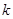
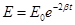

# Virtual Physical Laboratory “Mass Spring Damper System”

**Project Mission:** to develop a virtual physical laboratory for simulation a free damped oscillations of a spring pendulum

**Programming Language:** C++

**Framework:** Qt4 / Qt5

**License:** [GNU GPL v3](http://www.gnu.org/copyleft/gpl.html)

## System Description

This software simulates free damped oscillations of a spring pendulum.

The software allows you to adjust the following parameters of the model:
 * Mass
 * Initial displacement
 * Spring constant
 * Damping coefficient

The stopwatch, the experiment speed slider and the ruler to measure the displacement were added to improve usability.

The software allows you to plot graphs of the following functions:
 * Displacement as a function of time
 * Speed as a function of time
 * Energy as a function of time

## Model

 — damping coefficient,

 — spring constant,

 — mass,

 — initial displacement,

 — displacement,

 — time,

 — ringing frequency of free undamped oscillations,

 — attenuation rate,

 — ringing frequency of free damped oscillations,

 — period of oscillation,

 — oscillation amplitude at the time equal to the period,

 — logarithmic decrement,

 — energy at the start of the experiment,

 — current displacement,

 — current speed,

 — current energy.

