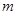
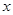
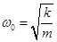
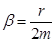
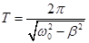
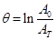
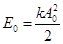
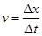

# Виртуальная физическая лаборатория «Пружинный маятник в среде с сопротивлением»

**Цель проекта:** разработать программный продукт, представляющий собой виртуальную физическую лабораторию, моделирующую поведение пружинного маятника в среде с сопротивлением

**Язык программирования:** C++

**Фреймворк:** Qt4 / Qt5 / Qt6

**Лицензия:** [GNU GPL v3](http://www.gnu.org/copyleft/gpl.html)

## Описание установки

В программе моделируются свободные затухающие колебания пружинного маятника.

Существует возможность изменять следующие параметры модели:
 * массу груза
 * начальное смещение груза от положения равновесия
 * коэффициент жёсткости пружины
 * коэффициент сопротивления среды

Для удобства проведения эксперимента добавлены секундомер и возможность изменения скорости опыта, а так же линейка для измерения смещения груза от положения равновесия.

В программе могут быть выведены графики следующих зависимостей:
 * смещения от времени
 * скорости от времени
 * энергии от времени

## Модель

 — коэффициент сопротивления среды,

 — коэффициент жёсткости пружины,

 — масса груза,

 — начальная амплитуда,

 — смещение груза,

 — время,

 — циклическая частота свободных незатухающих колебаний,

 — коэффициент затухания,

 — циклическая частота свободных затухающих колебаний,

 — период колебаний,

 — амплитуда колебаний в момент времени, равный периоду,

 — логарифмический декремент,

 — энергия в начале эксперимента,

 — смещение в текущий момент времени,

 — скорость в текущий момент времени,

 — энергия в текущий момент времени.

